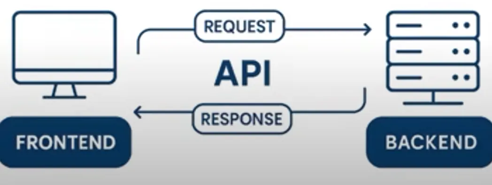
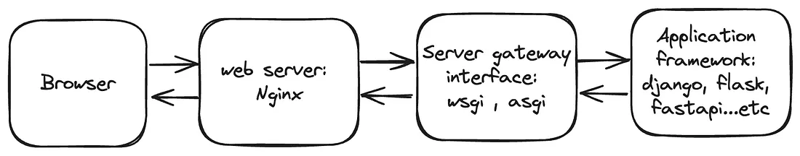

# What is an API ?

- APIs are mechanisms that enable two software components such as the frontend and backend of an application to communicate with each other using a defined set of rules, protocols and data formats.

- Before APIs , we used to use Monolithic Architecture for projects.the Frontend and backend were tightly coupled. One change affects the entire Architecure components. (e.g. using flask or php for creating websites.)

# What is FastAPI ?

- FastAPI is a modern, high-performance web framework for building APIs with Python.
- It is built upon pythons' two popular libraries : Starlette and Pydantic

- Starlette manages how your API receives requests and sends back responses.
- Pydantic ensures that data is in proper format or not.

## Key Features:

1. High Performance:
FastAPI is designed for speed, often outperforming other Python frameworks like Flask. It utilizes asynchronous programming and efficient libraries like Starlette and Pydantic for performance.

2. Automatic Documentation:
FastAPI automatically generates interactive documentation using the OpenAPI standard. This allows developers to quickly see and test API endpoints.

3. Type Hints:
FastAPI leverages Python’s type-hinting system to enable type validation and automatic data serialisation, reducing errors and improving code readability.

4. Easy to Learn and Use:
FastAPI is known for its intuitive design and ease of use, making it a good choice for beginners and experienced developers alike.

5. Asynchronous Support:
FastAPI is built on top of Starlette, allowing for asynchronous programming, which is crucial for handling large numbers of concurrent requests.

# Web Server Architecture

- The interaction between the web server and the server gateway interface is managed by a protocol that outlines the guidelines for their communication. In Python, the protocol may be the Web Server Gateway Interface (WSGI) or the Asynchronous Server Gateway Interface (ASGI)

# 1. Web Server Gateway Interface (WSGI):

- WSGI (Web Server Gateway Interface) is a specification that outlines the communication protocol between the web server and a server gateway interface.
- It defines a straightforward interface for managing HTTP requests and responses, enabling developers to create web applications in Python without the need to delve into the intricacies of the underlying server.
- WSGI operates by exposing a Python function to the web server, typically named ‘application’ or ‘app’ by default. 
- Django and Flask both utilize WSGI.
- WSGI servers operate in a synchronous manner, they handle one request at a time, blocking the connection until the result is returned.

# 2. Asynchronous Server Gateway Interface (ASGI) :

- ASGI is a more recent specification crafted to facilitate asynchronous programming in Python. Unlike WSGI, which is tailored for synchronous requests, ASGI empowers developers to create web applications that can handle multiple requests concurrently, without impeding the main thread.

- To implement ASGI, you can define a function named ‘application’ that accepts three parameters.

i. scope: A dictionary with information about the current request, akin to environ in WSGI, but with a slightly different naming convention for the details.. For example, method, path, headers, query_string…etc.
ii. receive: An async callable (function) that lets the application send messages back to the client.
iii. send: An async callable that lets the application receive messages from the client..

